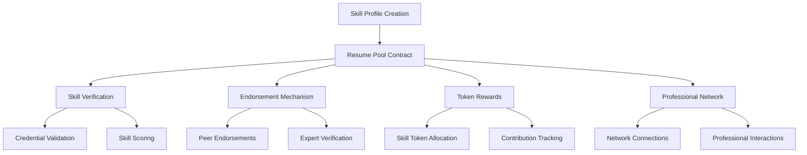

# AMM Resume Pool

A decentralized platform for professional skill verification and career networking using blockchain technology. AMM Resume enables professionals to create verifiable credentials, endorse skills, and participate in a decentralized professional ecosystem.

## Overview

AMM Resume provides a comprehensive framework for professional skill management and verification:

- Blockchain-backed resume creation
- Skill endorsement and verification
- Professional credential tracking
- Skill token economy
- Decentralized professional networking
- Reputation and skill assessment

## Architecture

The platform is built around a core smart contract managing professional skill pools:



### Core Components:

1. **Professional Profile Management**
   - Blockchain-verified resume creation
   - Skill declaration and tracking
   - Credential verification

2. **Skill Endorsement System**
   - Peer and expert skill verification
   - Decentralized reputation scoring
   - Transparent endorsement mechanism

3. **Token Economy**
   - Skill token generation
   - Reward for verified skills
   - Professional network incentivization

## Getting Started

### Prerequisites

- Clarity CLI
- Stacks wallet
- Minimum skill verification stake

### Basic Usage

1. **Create Professional Profile**
```clarity
(contract-call? .resume-pool create-profile 
    "Jane Doe" 
    "Software Engineer" 
    u1000)
```

2. **Endorse a Skill**
```clarity
(contract-call? .resume-pool endorse-skill 
    profile-id
    "Blockchain Development"
    u5)
```

3. **Verify Credentials**
```clarity
(contract-call? .resume-pool verify-credential
    profile-id
    "University Degree"
    "MIT Computer Science")
```

## Function Reference

### Profile Management

- `create-profile`: Initialize professional profile
- `update-profile`: Modify profile details
- `add-skill`: Declare new professional skill
- `remove-skill`: Remove a skill from profile

### Skill Endorsement

- `endorse-skill`: Peer skill endorsement
- `verify-credential`: Expert credential verification
- `calculate-skill-score`: Assess skill proficiency

### Token Economy

- `mint-skill-tokens`: Generate tokens for verified skills
- `transfer-skill-tokens`: Exchange skill tokens
- `claim-network-rewards`: Claim professional network participation rewards

## Security Considerations

### Data Integrity
- Immutable skill records
- Cryptographic verification
- Anti-tampering mechanisms

### Endorsement Protection
- Weighted endorsement scoring
- Sybil attack prevention
- Expert verification layers

### Token Security
- Transparent token allocation
- Stake-based reward mechanisms
- Controlled token generation

## Development

### Local Testing

1. Deploy contract:
```bash
clarinet deploy
```

2. Run test suite:
```bash
clarinet test
```

### Key Constants

```clarity
MIN-PROFILE-STAKE: u1000
ENDORSEMENT-THRESHOLD: u3
TOKEN-GENERATION-RATE: u10
```

### Skill Levels

```clarity
SKILL-BEGINNER: u1
SKILL-INTERMEDIATE: u2
SKILL-EXPERT: u3
SKILL-MASTER: u4
```